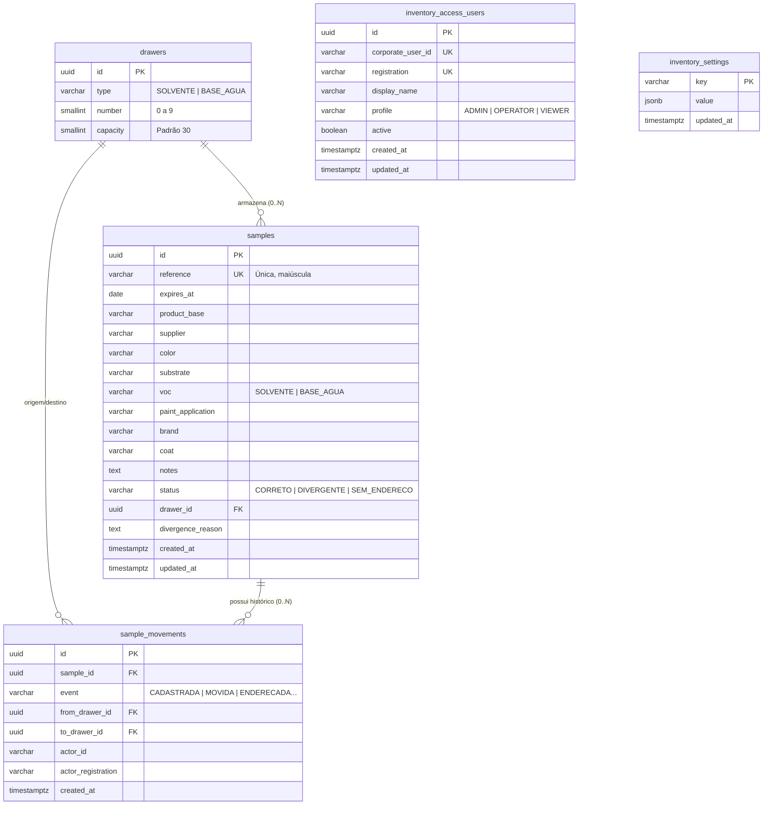

# Mapeamento e Análise Técnica do Banco de Dados PostgreSQL

> **Projeto**: DASS Inventário de Amostras de Tintas (`dass-inventory`)  
> **Schema Principal**: `amostras_tintas`  
> **Gerenciador de Banco de Dados**: PostgreSQL  
> **ORM / Migration**: TypeORM (`InitialAmostrasTintas`)  
> **Data do Mapeamento**: 02 de Agosto de 2026  

---

## 1. Visão Geral da Arquitetura de Dados

O banco de dados do sistema **DASS Inventário** opera sobre um schema relacional isolado chamado **`amostras_tintas`**, garantindo total encapsulamento de dados e convivência segura com outros módulos corporativos.

- **Chaves Primárias**: Identificadores Únicos Universais (`uuid`) gerados nativamente pelo PostgreSQL (`gen_random_uuid()`).
- **Integridade Referencial**: Chaves estrangeiras com regras explícitas de deleção (`ON DELETE SET NULL`), preservando a rastreabilidade histórica.
- **Rastreabilidade e Auditoria**: Registro imutável de movimentações e logs de ações por usuário corporativo.

---

## 2. Diagrama de Entidade e Relacionamento (Mermaid ERD)

---

## 3. Detalhamento Estrutural das Tabelas (`amostras_tintas`)

### 3.1. Tabela `drawers` (Gavetas de Armazenamento)
Armazena a infraestrutura física de gavetas disponíveis para armazenamento das amostras.

| Coluna | Tipo PostgreSQL | Requisitos | Descrição |
| :--- | :--- | :--- | :--- |
| `id` | `uuid` | `PRIMARY KEY`, Default `gen_random_uuid()` | Identificador único da gaveta. |
| `type` | `varchar(20)` | `NOT NULL` | Tipo da gaveta (`SOLVENTE` ou `BASE_AGUA`). |
| `number` | `smallint` | `NOT NULL`, `CHECK (0 a 9)` | Número da gaveta na fileira. |
| `capacity` | `smallint` | `NOT NULL`, Default `30`, `CHECK (> 0)` | Capacidade de armazenamento individual. |

- **Constraints**: 
  - `UQ_drawers_type_number` (`UNIQUE (type, number)`): Impede duplicidade de número de gaveta por tipo.
  - `CHK_drawers_number`: Garante números entre 0 e 9.

---

### 3.2. Tabela `samples` (Amostras de Tintas)
Tabela central contendo os atributos físico-químicos, situação de validade e o vínculo com a gaveta de armazenamento.

| Coluna | Tipo PostgreSQL | Requisitos | Descrição |
| :--- | :--- | :--- | :--- |
| `id` | `uuid` | `PRIMARY KEY`, Default `gen_random_uuid()` | Identificador único da amostra. |
| `reference` | `varchar(80)` | `NOT NULL`, `UNIQUE` | Código de referência único da amostra. |
| `expires_at` | `date` | `NULLABLE` | Data de validade da tinta. |
| `product_base` | `varchar(120)` | `NULLABLE` | Base do produto. |
| `supplier` | `varchar(120)` | `NULLABLE` | Fornecedor da amostra. |
| `color` | `varchar(120)` | `NULLABLE` | Cor da tinta. |
| `substrate` | `varchar(120)` | `NULLABLE` | Substrato recomendado. |
| `voc` | `varchar(20)` | `NULLABLE` | Classificação VOC (`SOLVENTE` ou `BASE_AGUA`). |
| `paint_application` | `varchar(120)` | `NULLABLE` | Tipo de aplicação. |
| `brand` | `varchar(120)` | `NULLABLE` | Marca comercial. |
| `coat` | `varchar(40)` | `NULLABLE` | Demão da aplicação. |
| `notes` | `text` | `NULLABLE` | Observações operacionais. |
| `status` | `varchar(30)` | `NOT NULL`, Default `'SEM_ENDERECO'` | Status do endereçamento (`CORRETO`, `DIVERGENTE`, `SEM_ENDERECO`). |
| `drawer_id` | `uuid` | `NULLABLE`, `FK (drawers.id)` | Vínculo com a gaveta onde está física/atualmente guardada. |
| `divergence_reason` | `text` | `NULLABLE` | Registros opcionais de justificativa. |
| `created_at` | `timestamptz` | `NOT NULL`, Default `now()` | Data/hora de cadastro. |
| `updated_at` | `timestamptz` | `NOT NULL`, Default `now()` | Data/hora da última alteração. |

- **Constraints & Índices**:
  - `CHK_samples_expiration`: `CHECK (expires_at IS NULL OR manufactured_at IS NULL OR expires_at >= manufactured_at)`.
  - `IDX_samples_drawer_id`: Índice B-Tree em `drawer_id` para aceleração de buscas por gaveta.

---

### 3.3. Tabela `sample_movements` (Histórico de Movimentação)
Registra todas as ações e auditorias realizadas sobre uma amostra ao longo do seu ciclo de vida.

| Coluna | Tipo PostgreSQL | Requisitos | Descrição |
| :--- | :--- | :--- | :--- |
| `id` | `uuid` | `PRIMARY KEY`, Default `gen_random_uuid()` | Identificador do log. |
| `sample_id` | `uuid` | `NULLABLE`, `FK (samples.id ON DELETE SET NULL)` | ID da amostra auditada. |
| `event` | `varchar(50)` | `NOT NULL` | Tipo do evento (`CADASTRADA`, `MOVIDA`, `ENDERECO_REMOVIDO`, etc.). |
| `from_drawer_id` | `uuid` | `NULLABLE`, `FK (drawers.id)` | Gaveta de origem. |
| `to_drawer_id` | `uuid` | `NULLABLE`, `FK (drawers.id)` | Gaveta de destino. |
| `actor_id` | `uuid` | `NULLABLE` | ID do usuário realizador. |
| `actor_registration` | `varchar(100)` | `NULLABLE` | Matrícula corporativa do usuário. |
| `created_at` | `timestamptz` | `NOT NULL`, Default `now()` | Data/hora do evento. |

- **Índices**:
  - `IDX_sample_movements_sample_id_created_at`: Índice composto B-Tree em `(sample_id, created_at DESC)` para listagem ultrarrápida da linha do tempo.

---

### 3.4. Tabela `inventory_access_users` (Controle de Acessos)
Gere o controle de permissões e papéis de acesso no inventário.

| Coluna | Tipo PostgreSQL | Requisitos | Descrição |
| :--- | :--- | :--- | :--- |
| `id` | `uuid` | `PRIMARY KEY`, Default `gen_random_uuid()` | ID do registro de permissão. |
| `corporate_user_id` | `varchar(100)` | `NOT NULL`, `UNIQUE` | ID retornado pelo Auth Service corporativo. |
| `registration` | `varchar(50)` | `NULLABLE`, `UNIQUE` | Matrícula corporativa do usuário. |
| `display_name` | `varchar(200)` | `NOT NULL` | Nome completo para exibição. |
| `profile` | `varchar(20)` | `NOT NULL` | Perfil (`ADMIN`, `OPERATOR`, `VIEWER`). |
| `active` | `boolean` | `NOT NULL`, Default `true` | Status da permissão de acesso. |
| `created_at` | `timestamptz` | `NOT NULL`, Default `now()` | Data de concessão de acesso. |
| `updated_at` | `timestamptz` | `NOT NULL`, Default `now()` | Data de atualização do perfil. |

---

### 3.5. Tabela `inventory_settings` (Parâmetros Globais)
Armazena as configurações dinâmicas do sistema em formato chave-valor (`jsonb`).

| Coluna | Tipo PostgreSQL | Requisitos | Conteúdo Atual |
| :--- | :--- | :--- | :--- |
| `key` | `varchar(100)` | `PRIMARY KEY` | Chave da configuração (`maxDrawerCapacity`, `capacityAlertPercent`, etc.). |
| `value` | `jsonb` | `NOT NULL` | Valor em JSON (ex.: `100`, `80`, `30`). |
| `updated_at` | `timestamptz` | `NOT NULL`, Default `now()` | Timestamp da última alteração. |

---

## 4. Análise Técnica e Recomendações de Engenharia

### 🟢 Pontos Fortes da Arquitetura
1. **Encapsulamento por Schema (`amostras_tintas`)**: Permite convivência harmoniosa em bancos PostgreSQL compartilhados sem colisões de tabelas.
2. **Uso de Índices Estratégicos**: Os índices B-Tree em `samples(drawer_id)` e `sample_movements(sample_id, created_at DESC)` garantem consultas de alta velocidade para os filtros do inventário e linhas do tempo.
3. **Imutabilidade Histórica**: A tabela `sample_movements` usa `ON DELETE SET NULL`, garantindo que exclusões de amostras ou gavetas não corrompam os relatórios de auditoria passados.

### 💡 Recomendações de Crescimento Futuro
- **Índice para Ordenação de Validade**: Caso a base ultrapasse 50.000 amostras, recomenda-se criar um índice parcial B-Tree em `samples(expires_at ASC)` para acelerar consultas do filtro de amostras vencidas/próximas.
- **Particionamento Histórico**: Caso o volume de movimentações diárias atinja centenas de milhares, a tabela `sample_movements` poderá ser particionada por intervalo de datas (`RANGE BY (created_at)`).
